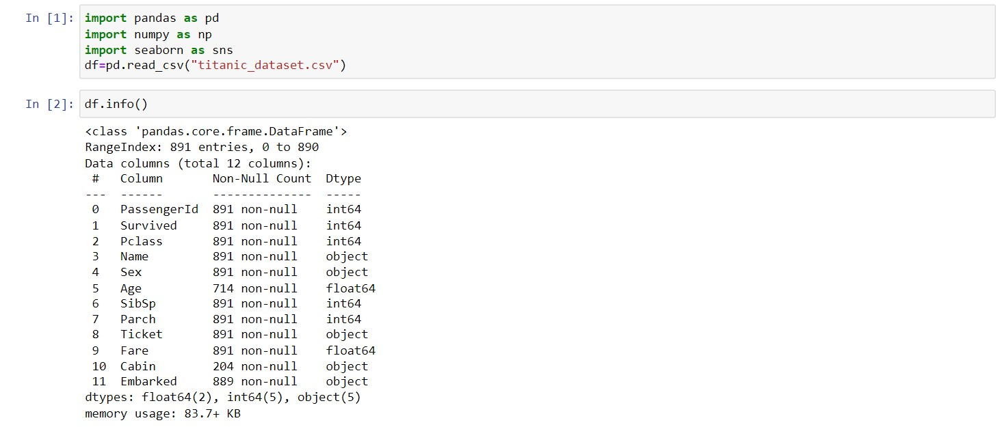
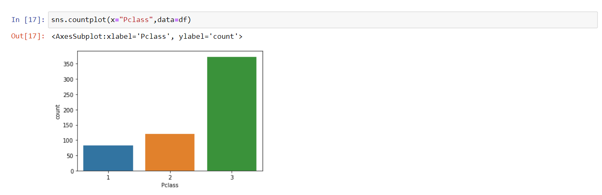

# Ex-03EDA

## AIM
To perform EDA on the given data set. 

# Explanation
The primary aim with exploratory analysis is to examine the data for distribution, outliers and 
anomalies to direct specific testing of your hypothesis.
 

# ALGORITHM
### STEP 1
Import the required packages to perform Data Cleansing,Removing Outliers and Exploratory Data Analysis.
### STEP 2
Replace the null value using any one of the method from mode,median and mean based on the dataset available.
### STEP 3
Use boxplot method to analyze the outliers of the given dataset.
### STEP 4
Remove the outliers using Inter Quantile Range method.
### STEP 5
Use Countplot method to analyze in a graphical method for categorical data.
### STEP 6:
Use displot method to represent the univariate distribution of data.
### STEP 7:
Use cross tabulation method to quantitatively analyze the relationship between multiple variables.
### STEP 8:
Use heatmap method of representation to show relationships between two variables, one plotted on each axis.


# CODE
```
import pandas as pd
import numpy as np
import seaborn as sns
df=pd.read_csv("titanic_dataset.csv")
df.info()
df.isnull().sum()
df["Age"]=df["Age"].fillna(df["Age"].median())
df["Embarked"]=df["Embarked"].fillna(df["Embarked"].mode()[0])
df["Cabin"]=df["Cabin"].fillna(df["Cabin"].mode()[0])
df.info()
df.isnull().sum()
df.boxplot()
cols = ['Age', 'SibSp','Parch','Fare'] # one or more.
Q1 = df[cols]. quantile(0.25)
Q3 = df[cols]. quantile(0.75)
IQR = Q3 - Q1
df = df[~((df[cols] < (Q1 - 1.5 * IQR)) |(df[cols] > (Q3 + 1.5 * IQR))). any(axis=1)]
df.boxplot()
df.info()
df["Embarked"].value_counts()
df["Pclass"].value_counts()
df["Survived"].value_counts()
sns.countplot(x="Survived",data=df)
sns.countplot(x="Pclass",data=df)
sns.countplot(x="Sex",data=df)
sns.displot(df["Fare"])
sns.countplot(x="Pclass",hue="Survived",data=df)
sns.countplot(x="Sex",hue="Survived",data=df)
sns.displot(df[df["Survived"]==0]["Age"])
sns.displot(df[df["Survived"]==1]["Age"])
pd.crosstab(df["Pclass"],df["Survived"])
pd.crosstab(df["Sex"],df["Survived"])
df.corr()
sns.heatmap(df.corr(),annot=True)
```
# OUPUT

## DATA CLEANSING:



## BOXPLOT METHOD TO ANALYZE OUTLIERS:


## REMOVING OUTLIERS USING IQR METHOD:


## COUNTPLOT METHOD FOR DATA ANALYSIS:

.png)



## DISPLOT METHOD FOR DATA ANALYSIS:


## COUNTPLOT METHOD TO COMPARE TWO ENTITIES:


## CROSS TABULATION FOR DATA ANALYSIS:


## CORRELATION METHOD:


# RESULT:
Hence the given data set has undergone data cleansing and outlier removal.Later Exploratory data analysis is done to get inference from the given data set.